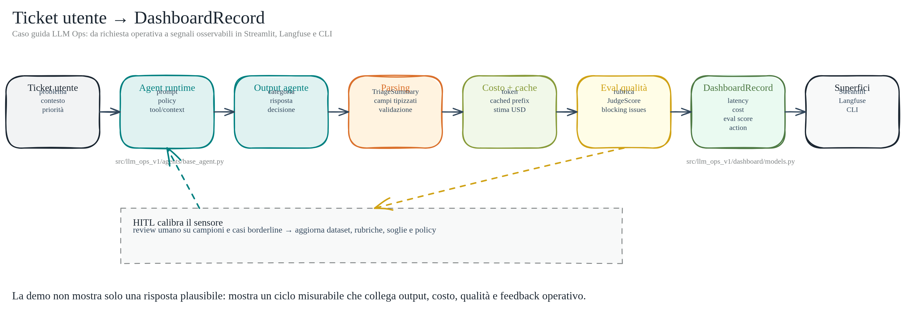

# Dal Ticket Alla Dashboard: Caso Guida, Eval e HITL

Questo articolo spiega il caso guida usato nella sessione **LLM Ops — Agents in
Production**. L'obiettivo non è costruire una chatbot generica, ma capire come un
sistema agentico diventa misurabile, monitorabile e migliorabile nel tempo.

Il caso è volutamente piccolo: un agente riceve un ticket operativo, produce una
risposta strutturata e genera segnali per costo, qualità e dashboard. Proprio perché
è piccolo, permette di discutere i problemi reali della produzione: classificazione
errata, escalation mancate, costo fuori controllo, caching inefficace, eval deboli e
intervento umano.

## Il Caso Guida

Il sistema gestisce ticket operativi con un agente LLM. Un ticket è una richiesta
tracciabile che richiede una decisione: rispondere, chiedere chiarimenti, escalare,
oppure avviare un intervento.

Esempi:

- un cliente segnala un ordine in ritardo;
- un utente segnala un doppio addebito;
- un cliente enterprise segnala che l'applicazione è bloccata sul login;
- un team riceve un bug report e deve capire severità, priorità e prossima azione.

Il dominio può cambiare: supporto clienti, ristorazione, software, operations interne.
Il punto didattico resta lo stesso. Un agente utilizzabile in produzione non deve solo "rispondere bene":
deve lasciare segnali osservabili.

## Il Flusso Del Sistema

Il flusso logico è questo:

```text
ticket utente
  -> agent runtime
  -> categoria + risposta + decisione
  -> parsing strutturato
  -> stima costo
  -> eval qualità
  -> DashboardRecord
  -> Streamlit / Langfuse / CLI
```



Diagramma editabile: [ticket-to-dashboard-flow](../public/36-ticket-to-dashboard-flow.excalidraw).

Tradotto in pratica:

1. entra una richiesta utente;
2. l'agente la interpreta usando prompt, policy e contesto;
3. produce categoria, bozza di risposta e decisione operativa;
4. il sistema estrae campi strutturati dall'output;
5. calcola costo stimato e token;
6. valuta la qualità della risposta;
7. salva un record operativo;
8. mostra i segnali in dashboard, trace o CLI.

## Cosa Produce L'Agente

L'agente deve produrre quattro elementi minimi:

- **categoria**: per esempio `shipping_delay`, `billing_issue`, `technical_problem`;
- **bozza di risposta**: testo pronto per cliente, utente o team;
- **decisione**: `reply`, `ask_clarification`, `escalate`;
- **costo stimato**: quanto è costata o potrebbe costare la run.

Questa forma è importante perché rende confrontabili le run. Se ogni risposta fosse
solo testo libero, sarebbe difficile costruire dashboard, eval e regressioni.

## Policy: Le Regole Operative

Le policy sono regole operative che guidano l'agente. Non sono decorazione del prompt:
sono vincoli che cambiano la decisione.

Esempi:

- "I ticket priority richiedono un aggiornamento entro 4 ore";
- "I reclami di fatturazione vanno escalati al team billing";
- "Gli outage enterprise vanno escalati subito al team tecnico";
- "Le richieste su allergeni o sicurezza non vanno risolte automaticamente";
- "Un bug critico in produzione richiede raccolta log e piano di rollback".

Le policy sono anche un buon esempio di contenuto statico: cambiano raramente, quindi
possono entrare nel prefix cacheable insieme al system prompt.

## Perché Il Caching Conta

Ogni token inviato al modello costa in denaro e latenza. In un sistema di ticket molte
parti si ripetono: istruzioni, policy, formato di output, rubriche e definizioni tool.
Il prompt prefix caching serve a non ripagare sempre lo stesso contesto statico.

Layout corretto:

```text
TOOLS statici
SYSTEM PROMPT statico
POLICY statiche
SESSION CONTEXT semi-statico
MESSAGGIO TICKET dinamico
```

Anti-pattern:

```text
timestamp dinamico
ticket id dinamico
SYSTEM PROMPT statico
POLICY statiche
MESSAGGIO TICKET dinamico
```

Se un valore dinamico finisce prima del blocco statico, il prefix cambia e la cache
perde efficacia. Il risultato è semplice: stesso comportamento, più costo.

La misura da osservare non è solo "cache hit sì/no", ma il risparmio: token cachati,
costo senza cache, costo con cache, percentuale di saving.

## Cosa Si Testa Davvero

Il caso guida permette di testare problemi concreti:

- **classificazione**: il ticket è finito nella categoria giusta?
- **decisione**: doveva rispondere, chiedere chiarimenti o escalare?
- **policy compliance**: ha rispettato SLA, escalation e vincoli?
- **qualità della risposta**: è utile, concreta, cortese e proporzionata?
- **groundedness**: ha inventato informazioni non presenti?
- **costo**: il costo è coerente con la complessità del ticket?
- **osservabilità**: la dashboard rende visibile cosa è successo?

Questo è il passaggio da demo a LLM Ops: non basta vedere un output plausibile. Serve
un modo per capire se il sistema sta migliorando o peggiorando.

## Eval: Dal Controllo Banale Alla Rubrica

Un eval minimale può controllare proprietà semplici: lunghezza minima, assenza di
placeholder, presenza di una decisione. È utile come fallback locale, ma non basta per
misurare la qualità reale.

Per un sistema di ticket serve una rubrica multi-criterio.

| Criterio | Domanda |
| --- | --- |
| Classificazione | La categoria scelta è corretta? |
| Decisione | La scelta `reply`, `ask_clarification` o `escalate` è corretta? |
| Aderenza policy | Rispetta SLA, escalation e vincoli del dominio? |
| Completezza | Risponde al problema reale? |
| Azione concreta | Propone un prossimo passo verificabile? |
| Tono | È cortese, chiara e non difensiva? |
| Groundedness | Evita informazioni inventate? |
| Sicurezza | Evita dati sensibili, promesse non autorizzate o azioni rischiose? |

Per ticket software, alcuni criteri diventano più specifici:

| Criterio | Domanda |
| --- | --- |
| Bug classification | È bug, incident, feature request, supporto o domanda? |
| Severity | La severità è corretta? |
| Repro steps | Chiede o ricostruisce passi di riproduzione? |
| Evidence | Distingue fatti, ipotesi e dati mancanti? |
| Next action | Propone fix, rollback, log check, escalation o chiarimento? |
| Risk control | Evita fix rischiosi senza contesto sufficiente? |

Un output eval utile non dovrebbe essere solo un numero. Dovrebbe indicare cosa è
andato bene, cosa blocca il passaggio e perché.

Esempio:

```json
{
  "classification_score": 5,
  "decision_score": 4,
  "policy_score": 5,
  "response_quality_score": 4,
  "groundedness_score": 5,
  "safety_score": 5,
  "passed": true,
  "blocking_issues": [],
  "rationale": "Risposta corretta, cortese e con azione concreta."
}
```

## Dataset Di Eval

Un eval serio richiede un piccolo dataset versionato. Non serve partire da mille casi:
anche 20-50 esempi ben scelti cambiano il modo in cui si sviluppa un agente.

Un caso eval dovrebbe contenere:

- testo del ticket;
- categoria attesa;
- decisione attesa;
- elementi che la risposta deve menzionare;
- elementi vietati;
- note di policy;
- eventuale giudizio umano.

Esempio:

```json
{
  "id": "software-outage-enterprise",
  "ticket": "La nostra app è bloccata sul login e il team non riesce a lavorare.",
  "expected_category": "technical_problem",
  "expected_decision": "escalate",
  "must_mention": ["team tecnico", "priorità urgente"],
  "forbidden": ["rimborso automatico"]
}
```

Il punto non è ottenere un output bello una volta. Il punto è poter rieseguire lo
stesso dataset dopo ogni cambio di prompt, modello, policy o tool.

## HITL: Human-in-the-loop

L'HITL non serve a trasformare ogni risposta in un processo manuale. Serve a calibrare
il sistema di misura.

Flusso corretto:

```text
agent risponde
  -> eval automatico assegna score e motivazione
  -> umano rivede campioni o casi borderline
  -> umano corregge label, decisione, soglia o rubrica
  -> dataset eval si aggiorna
  -> nuova versione agente viene testata sul dataset
```

L'umano può correggere:

- ground truth del dataset;
- soglia di pass/fail;
- peso dei criteri;
- policy mancanti;
- esempi negativi;
- casi in cui il judge è troppo severo o troppo permissivo.

Esempio: una risposta su allergeni riceve un punteggio alto perché è cortese e completa,
ma l'umano la boccia perché non escala. La correzione utile non è solo "risposta
sbagliata". La correzione diventa:

1. aggiungere un caso al dataset;
2. aggiornare la policy: allergeni -> escalation obbligatoria;
3. aggiornare la rubrica: mancata escalation allergeni = blocking issue;
4. rieseguire l'eval.

Questo è il loop maturo: l'umano migliora il sensore, non fa micro-management di ogni
risposta.

## Come I Punteggi Guidano Un Sistema Agentico

Gli eval non servono solo a posteriori. Possono guidare il comportamento runtime.

### Eval Come Gate

```text
score >= 8 -> invia
score 6-7  -> human review
score < 6  -> blocca, rigenera o escala
```

### Eval Come Router

```text
ticket semplice + rischio basso -> modello economico
ticket complesso + rischio policy -> modello più capace
eval basso o incertezza alta -> umano o escalation
```

### Eval Come Dato Di Miglioramento

Risposte approvate diventano esempi positivi. Risposte bocciate diventano regression
test. Ogni incidente reale dovrebbe generare almeno un nuovo caso eval.

### Eval Come Segnale Di Dashboard

La dashboard non deve mostrare solo volume e costo. Deve mostrare anche:

- score medio;
- pass rate;
- escalation rate;
- failure reasons;
- costo per risposta valida;
- qualità per categoria ticket.

## Frase Chiave

Un eval non è un voto scolastico alla risposta. È un sensore operativo.

HITL non serve a correggere ogni output a mano. Serve a calibrare il sensore e a
trasformare errori reali in test ripetibili.

## Cosa Portarsi A Casa

Un sistema agentico affidabile richiede almeno:

1. output strutturato;
2. policy esplicite;
3. stima di costo;
4. eval ripetibile;
5. dashboard o trace;
6. correzione umana che aggiorna dataset e rubrica.

Questa è la differenza tra "ho fatto una chatbot" e "ho costruito un sistema che posso
mettere sotto controllo".
