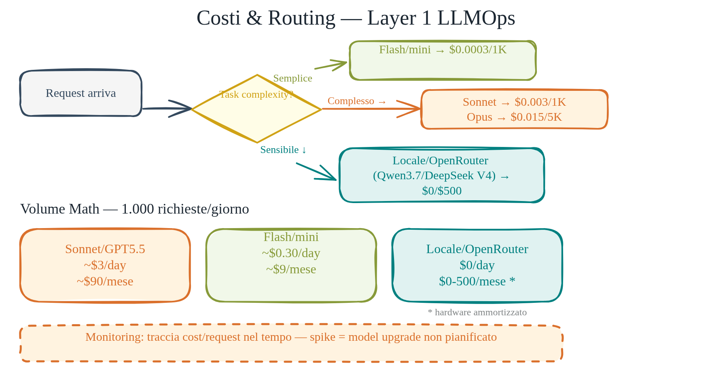
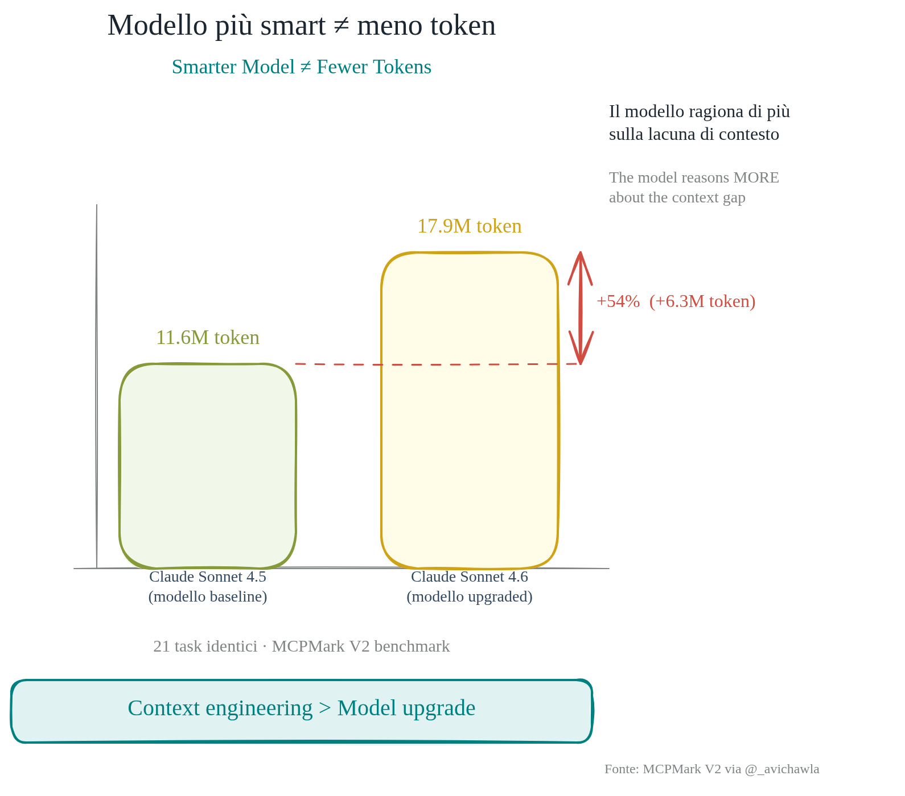
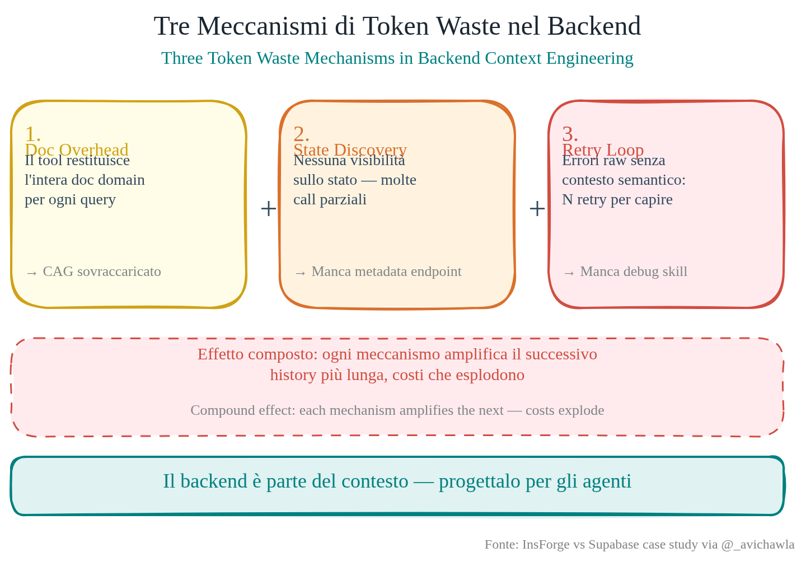

# Costo e Routing dei Modelli

> Non tutti i task hanno bisogno dello stesso modello.

Quando costruisci un sistema multi-agente o una pipeline LLM in produzione, il costo non è un dettaglio da gestire dopo. È un vincolo di design. Un agent che classifica l'intent di un ticket di supporto non ha bisogno dello stesso potere computazionale di uno che sintetizza report legali — eppure senza un layer di routing esplicito, entrambi finiscono sullo stesso modello premium.

Nel listino configurato per la demo, la differenza di prezzo tra provider può essere di uno o due ordini di grandezza. I valori numerici usati in questo repository sono esempi didattici: vanno letti dalla tabella in `commercial_models.py` e aggiornati prima di applicarli a un caso reale. Il routing va trattato come parte del design economico del sistema, non come rifinitura successiva.

In questa sessione costruiamo il layer economico partendo dai dati di prezzo, passando per il calcolo del costo per richiesta, fino al pattern concettuale del router. Il codice vive in `src/llm_ops_v1/economics/`.

## Modelli hosted vs modelli locali

I modelli hosted (Anthropic, OpenAI, Google, OpenRouter) si pagano a token. I modelli locali (Ollama, MLX) si pagano a infrastruttura — ore di GPU o CPU, indipendentemente dall'utilizzo.



La scelta non è solo economica. I modelli locali possono dare latenza prevedibile, controllo sul data egress e nessun rate limit del provider. Richiedono però hardware, manutenzione e hanno spesso context window più piccole rispetto ai frontier model. `LocalModelProfile` nel modulo `local_models.py` cattura questi parametri: `model`, `runtime`, `context_window`, `estimated_hourly_infra_usd`.

Per i modelli locali il costo è proporzionale alla latenza, non ai token: `estimate_local_infra_cost("ollama:qwen3.6:35b-a3b", latency_seconds=1.4)` restituisce il costo stimato in dollari per quella singola inferenza, basandosi sul costo orario configurato nel profilo locale. I modelli MoE (Mixture of Experts) possono attivare solo un sottoinsieme di parametri per ogni token; il vantaggio reale dipende da hardware, runtime e modello specifico.

## Anatomia del costo

Ogni chiamata a un modello hosted produce tre tipi di token fatturabili, rappresentati in `PricingModel`:

- **input tokens** — il prompt inviato, incluso system prompt e contesto
- **cached input tokens** — la porzione di input già presente nella cache del provider (KV cache)
- **output tokens** — la risposta generata

La formula applicata in `estimate_token_cost` è:

```
billable_input = max(input_tokens - cached_input_tokens, 0)
total_cost = billable_input × input_price + cached_input_tokens × cached_price + output_tokens × output_price
```

Il caching può ridurre in modo significativo il costo dell'input quando il provider applica prezzi diversi ai token cachati. `CostBreakdown` è un frozen dataclass che espone ogni componente separatamente — utile per logging e per capire dove va il budget effettivo.

> **Sotto il cofano — perché output costa di più dell'input**
>
> Il prompt attraversa un _prefill_: tutti i token vengono processati in parallelo in un solo forward pass, compute-bound. La GPU lavora a piena capacità, il costo per token è basso. La risposta attraversa invece il _decode_: un token alla volta, un forward pass per ogni token, memory-bound. Ad ogni step si leggono tutti i pesi del modello dalla VRAM — più pesi, più banda, più tempo. Da qui la differenza di prezzo: output token = decode puro, e il decode ha un costo strutturalmente più alto. Il caching abbatte il costo di input saltando il prefill del prefix statico: la KV cache per quel blocco è già calcolata e viene riusata direttamente.
>
> → [`theory/02-prefill-decode-kvcache.md`](theory/02-prefill-decode-kvcache.md)

## Budget guard

`check_budget(estimated_cost_usd, session_total_usd=0.0)` legge la variabile d'ambiente `DAILY_SPEND_CAP_USD` e solleva `BudgetExceeded` se la somma tra la spesa corrente e quella stimata supera il cap. Va chiamato prima di ogni richiesta costosa — in un agent pipeline, tipicamente nel layer di orchestrazione prima di inviare al provider.

Il pattern è semplice: stima il costo con `estimate_token_cost`, verifica con `check_budget`, poi procedi con la chiamata. Se il cap non è configurato, la funzione è un no-op.

## Volume math — dal costo per richiesta alla spesa mensile

Un singolo ticket di triage: ~1.200 token input, ~350 output, 800 cached. Con i prezzi configurati nella demo per `openai:gpt-5.5`:

```
billable_input = 1200 - 800 = 400 token → $0.0020
cached_input   = 800 token            → $0.0004
output         = 350 token            → $0.0105
total          = $0.0129 per richiesta
```

A 50.000 richieste/mese → **$645/mese** nel modello di costo della demo. Con un secondo profilo di prezzo configurato nel repo, lo stesso workload produce una stima diversa. Questo non significa che un provider sia sempre "meglio" dell'altro: significa che il routing va discusso come tradeoff tra qualità, costo, latenza e rischio. Il modello più capace non deve diventare automaticamente il default per ogni ticket semplice.



## Model routing — il pattern concettuale

Il routing consiste nel selezionare il modello più economico che soddisfa i requisiti di qualità del task. I dati per questa decisione esistono già: `get_pricing(model_id)` restituisce il `PricingModel` per ognuno dei 4 provider commerciali in `COMMERCIAL_MODELS`, e `estimate_token_cost` calcola il costo atteso dato un profilo di utilizzo.

Un router minimale farebbe così: per ogni task, classifica la complessità (semplice/media/complessa), mappa la complessità a una lista ordinata di modelli candidati, seleziona il più economico che ha capacità sufficienti. Le capacità possono essere valutate con benchmark su un sample set.

**Nota:** `router.py` contiene anche un client HTTP per OpenRouter. La selezione automatica del modello va comunque validata sul dataset del dominio prima di usarla fuori dalla demo.



## Benchmarking multi-modello

`benchmark_prompt(prompt, jobs)` lancia lo stesso prompt su più modelli in parallelo e restituisce una lista di `BenchmarkResult`, ognuno con `latency_seconds`, `cost` (un `CostBreakdown` completo), e `output_preview`. `BenchmarkJob` è un frozen dataclass che accoppia `model_id` con la chiamata da eseguire.

Il benchmark serve a costruire una mappa empirica qualità/costo su task reali del dominio. Se un modello più costoso produce lo stesso risultato sulle query di classificazione, quel dato può guidare una regola di routing più economica.

## OpenRouter come livello di astrazione

OpenRouter espone un'API compatibile OpenAI che aggrega decine di provider, inclusi modelli open-weight ospitati da terzi. `OpenRouterClient` in `router.py` è un thin async HTTP client: legge `OPENROUTER_API_KEY` dall'environment e chiama `chat_completion(model, messages, max_tokens, temperature)`.

Il vantaggio operativo è avere un singolo endpoint per confrontare modelli open-weight ospitati e modelli commerciali senza gestire SDK separati. Utile nella fase di benchmarking e come fallback quando un provider primario è in degraded state.

## Come provare

Calcolo costo con caching su `gpt-5.5`:

```python
from llm_ops_v1.economics.commercial_models import get_pricing
from llm_ops_v1.economics.cost_calculator import estimate_token_cost

breakdown = estimate_token_cost(
    get_pricing("openai:gpt-5.5"),
    input_tokens=1_200, output_tokens=350, cached_input_tokens=800
)
print(breakdown.total_cost_usd)
```

Costo infrastruttura locale per un'inferenza:

```python
from llm_ops_v1.economics.local_models import estimate_local_infra_cost
cost = estimate_local_infra_cost("ollama:qwen3.6:35b-a3b", latency_seconds=1.4)
```

Avviare il triage agent via CLI:

```bash
uv run llm-ops triage "Il mio ordine è in ritardo"
```

Listare i modelli commerciali disponibili con i loro prezzi:

```python
from llm_ops_v1.economics.commercial_models import list_commercial_models, get_pricing
for m in list_commercial_models():
    p = get_pricing(m)
    print(f"{m}: input ${p.input_per_1m_usd} / output ${p.output_per_1m_usd}")
```

## Per approfondire

- [Mollick — Mass Intelligence](resources/reading_list.md) — GPT-4 $50/M → GPT-5 Nano $0.14/M; la matematica che cambia il routing
- [Model pricing e decision tree](resources/reading_list.md) — Blocco 4, Modelli Alternativi
- [Diagramma editabile](../public/33-routing-decision-tree.excalidraw) — albero decisionale routing (schema Excalidraw)

## Routing cost-aware

La versione base del router (`agents/router.py`) sceglie il modello per keyword
di complessità. La versione aggiornata integra il costo stimato nella decisione:

```python
from llm_ops_v1.agents.router import decide_form, route_trace

form = decide_form("Enterprise billing outage urgente")
print(route_trace(form))
# PATH: INPUT -> anthropic:claude-sonnet-4-6 -> OUTPUT -> tool_use_required est=$0.000018
```

La logica: per ogni tier (semplice/complesso) viene stimato il costo con
`estimate_token_cost()`. Se il costo supera il budget di sessione
(`DAILY_SPEND_CAP_USD`), il router fa downgrade a Haiku invece di escalare.
Il campo `AgentForm.estimated_cost_usd` porta il costo stimato al chiamante.

**Differenza rispetto al routing per keyword:**
Il routing puro per keyword dice "è complesso → Sonnet". Il routing cost-aware
dice "è complesso, ma se Sonnet supera il budget → Haiku invece". Introduce
un freno economico senza perdere la decisione di complessità.
