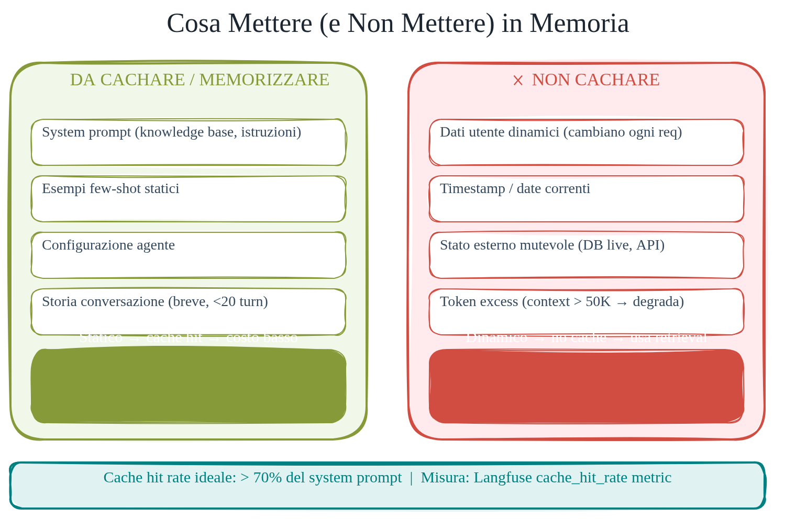
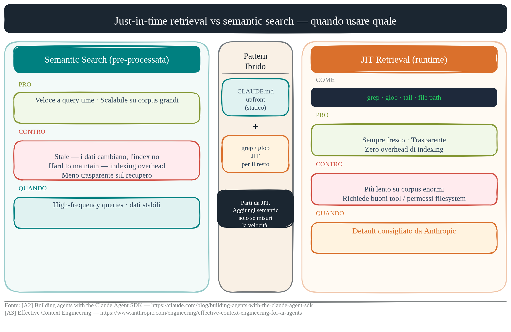
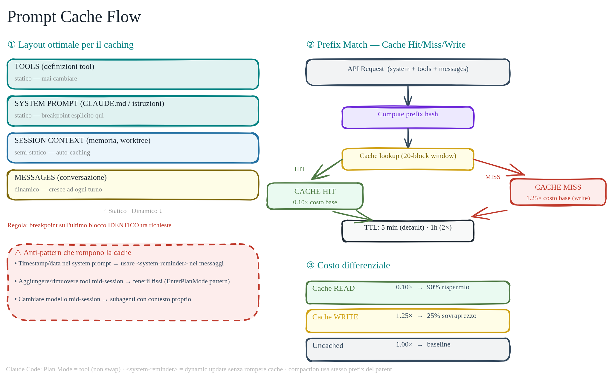
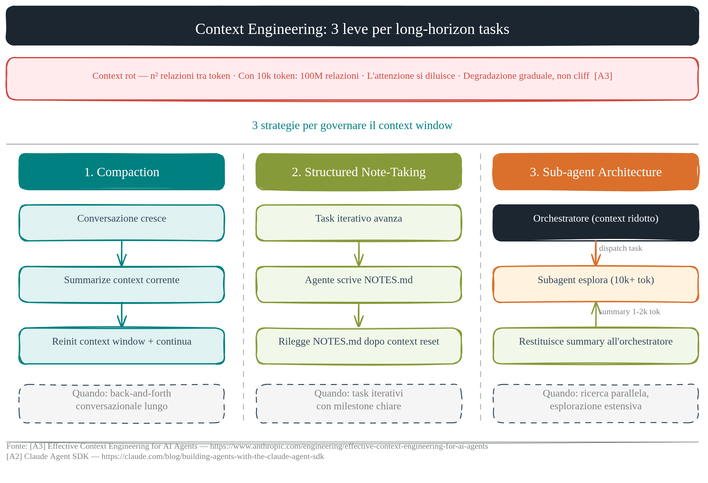
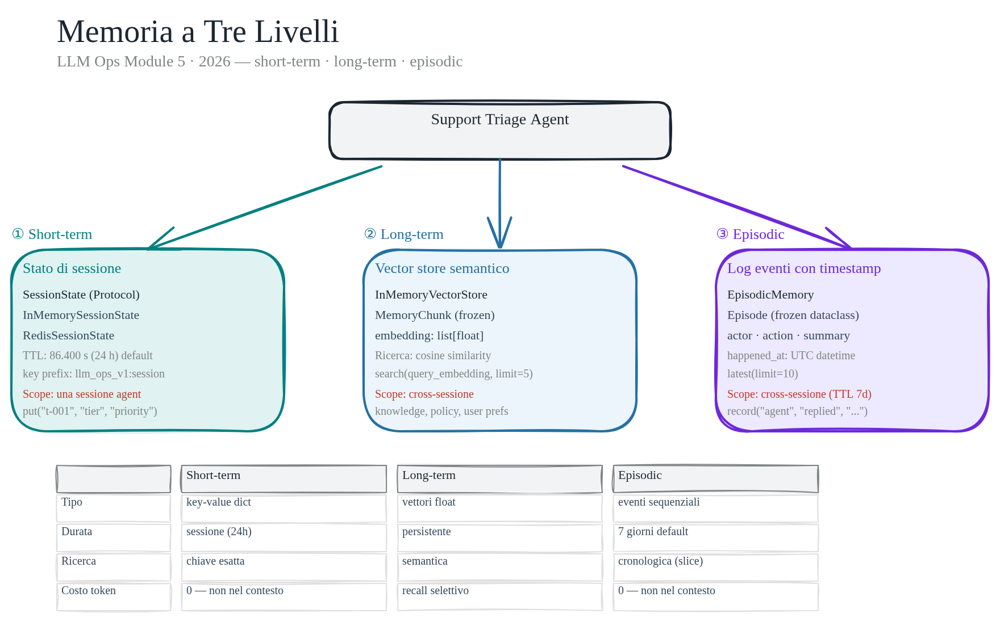

# Contesto, Memoria, Caching

> Il contesto non è gratuito.

Ogni token che entra nella finestra di contesto costa: in latenza, in denaro, in complessità. Un agente in produzione che non gestisce il contesto in modo esplicito accumula costi nascosti sessione dopo sessione. Memoria e caching sono quindi parte del design operativo, non solo dettagli implementativi.

In questo progetto il sistema di memoria è diviso in tre livelli ortogonali. Ognuno risponde a una domanda diversa: cosa sa l'agente _adesso_ (short-term), cosa ha imparato _nel tempo_ (long-term), cosa è _successo_ in passato (episodic). Il caching agisce su un quarto asse: ridurre il costo di ripetere il contesto statico ogni volta che un nuovo messaggio arriva.

Il codice che segue è nel package `src/llm_ops_v1/memory/` e in `src/llm_ops_v1/caching/`, con test dedicati nel repo.

## Memoria short-term — stato di sessione

La memoria short-term tiene lo stato della sessione corrente: chi è l'utente, qual è il suo tier, quali preferenze ha espresso in questa conversazione. È la working memory dell'agente.

Il modulo `short_term.py` espone un `Protocol` semplice con tre metodi: `put(session_id, key, value)`, `get(session_id, key, default)`, `snapshot(session_id)`. Due implementazioni concrete:

- `InMemorySessionState` — `defaultdict(dict)`, zero dipendenze, adatta a test e sviluppo locale.
- `RedisSessionState(redis_url, ttl_seconds=86_400, key_prefix="llm_ops_v1:session")` — ogni sessione è uno hash Redis. Ogni write usa una pipeline atomica (`HSET` + `EXPIRE` in un'unica transazione) per garantire che TTL e dato si aggiornino insieme.

La factory `create_session_state(redis_url=None)` gestisce il fallback: se Redis non risponde al `ping()` iniziale, torna a `InMemorySessionState`. Per una demo o una cache non critica è accettabile; per dati di business critici il fallback silenzioso va evitato o reso esplicito con alert.

```python
from llm_ops_v1.memory.short_term import create_session_state

session = create_session_state(redis_url="redis://localhost:6379")
session.put("ticket-001", "customer_tier", "priority")
tier = session.get("ticket-001", "customer_tier")  # "priority"
```

## Memoria long-term — vector store semantico

La memoria long-term non è una lista di fatti: è un indice semantico su esperienze passate. La ricerca non avviene per chiave esatta ma per vicinanza semantica — "cosa abbiamo già risolto di simile a questo ticket?"

Il modulo `long_term.py` definisce `MemoryChunk`, un frozen dataclass con `memory_id`, `content`, `embedding: list[float]`, e `metadata: dict[str, str]`. L'`InMemoryVectorStore` espone `add(chunk)` e `search(query_embedding, limit=5)` — la ricerca ordina i chunk per cosine similarity calcolata in pure Python, con gestione esplicita del caso zero-norm.

In produzione il vector store potrebbe essere pgvector o Qdrant. Qui l'implementazione in-memory rende visibile il meccanismo senza introdurre un servizio esterno.



## Memoria episodica — log eventi

La memoria episodica risponde a "cosa ha fatto questo agente?" — non cosa sa, ma cosa ha _fatto_. È un audit log strutturato che può essere riletto per debug, per analisi comportamentale, o come contesto per decisioni successive.

Il modulo `episodic.py` definisce `Episode(actor, action, summary, happened_at: datetime)` come frozen dataclass. `EpisodicMemory` funziona in-memory o su Redis (lista append-only con TTL di 7 giorni, `604_800` secondi).

Tre metodi principali:

- `record(actor, action, summary) -> Episode` — timestamp UTC automatico, scrittura atomica su Redis con pipeline su due chiavi: `global` e `actor:<sha256>`.
- `latest(limit=10)` — ultimi N episodi globali.
- `latest_for_actor(actor, limit=10)` — filtro per attore senza scan lineare (Redis list per-actor).

```python
from llm_ops_v1.memory.episodic import EpisodicMemory

episodes = EpisodicMemory()
episodes.record("support-agent", "replied", "Draft risposta per ritardo spedizione")
recent = episodes.latest(limit=5)
```



## Prompt prefix caching — il layout che conta

Il caching del prefix riduce il costo di input ripetendo il contesto statico (system prompt, policy aziendali, tool definitions) senza riprocessarlo a ogni chiamata. L'entità del risparmio e le soglie di attivazione dipendono dal provider, dal modello e dal layout effettivo del prompt.

Il modulo `caching/prompt_prefix.py` implementa:

- `cache_key(system_prompt, policy_snippets) -> str` — SHA-256 del testo normalizzato (whitespace collassato, ordine stabile), usato per invalidazione.
- `CacheDelta(uncached_cost_usd, cached_cost_usd, savings_usd, savings_pct)` — frozen dataclass con la differenza di costo.
- `PromptPrefixCacheEstimate` — stima completa con token breakdown, costi prima/dopo, e `delta`.
- `estimate_support_triage_cache_demo(ticket_prompt, output, policy_snippets=None, model_id="openai:gpt-5.5")` — demo precablata che usa `SUPPORT_TRIAGE_SYSTEM_PROMPT` e `DEFAULT_SUPPORT_POLICY_SNIPPETS` da `agents/base_agent.py` come prefix cacheable.

Un layout stabile per massimizzare il cache hit rate:

```
SYSTEM PROMPT (statico)
  ↓
TOOLS (statico)
  ↓
SESSION CONTEXT (semi-statico, cambia raramente)
  ↓
MESSAGES (dinamico — solo questa parte varia)
```

L'anti-pattern che distrugge il caching: inserire contenuto dinamico (timestamp, session ID, contatore richieste) prima del system prompt. Un singolo token che cambia invalida tutto il prefix successivo. Il `cache_key` SHA-256 serve esattamente a rendere visibile quando il prefix è cambiato rispetto alla chiamata precedente.

> **Sotto il cofano — perché un token cambiato invalida tutto il prefix a valle**
>
> Quando invii un prefix statico per la prima volta, il modello esegue il prefill e calcola le matrici Key-Value (K/V) per ogni layer. Il provider salva quella KV cache associandola a un hash della sequenza di **token ID** — non della KV cache stessa. Alla richiesta successiva con lo stesso prefix, l'hash coincide: il prefill viene saltato, la KV cache viene riusata, si parte direttamente dal decode. Nei Transformer l'attention è causale: ogni token dipende da tutti i token che lo precedono. Un solo token cambiato al token N modifica i K/V di N e di ogni token successivo — il prefix è una catena, e romperla all'anello N invalida tutto ciò che viene dopo. È lo stesso meccanismo che spiega l'anti-pattern del timestamp prima del system prompt.
>
> → [`theory/02-prefill-decode-kvcache.md`](theory/02-prefill-decode-kvcache.md) · [`theory/04-prompt-caching-internals.md`](theory/04-prompt-caching-internals.md)





## Il contesto come costo — compaction e separazione

Un agente che accumula contesto senza strategia esaurisce la finestra e degrada le performance prima di esaurire il budget. Due meccanismi pratici:

**Compaction** — invece di passare l'intera conversazione a ogni turno, si riassumono i turni precedenti in un blocco compatto. Il modello legge il riassunto, non la trascrizione integrale. Il costo scende; la qualità del ragionamento rimane stabile se il riassunto è fedele.

**Separazione statico/dinamico** — il contesto va separato fisicamente in due bucket prima di costruire la request. Il bucket statico (system prompt, policy, tool schema) va in prefix caching. Il bucket dinamico (messaggi, stato sessione corrente) entra fresco a ogni chiamata. `snapshot(session_id)` di `SessionState` fornisce lo stato corrente serializzabile da iniettare nel bucket dinamico.

La misura di successo è `savings_pct` nel `CacheDelta`: sotto il 40% su workload ripetitivo, il layout del prefix va rivisto.



## Come provare

Esempio locale:

```bash
docker-compose up -d redis
uv run pytest tests/evals/unit/ -x -q
```

Poi dal REPL:

```python
from llm_ops_v1.memory.short_term import InMemorySessionState
from llm_ops_v1.memory.episodic import EpisodicMemory
from llm_ops_v1.caching.prompt_prefix import estimate_support_triage_cache_demo

session = InMemorySessionState()
session.put("t-001", "customer_tier", "priority")

episodes = EpisodicMemory()
episodes.record("agent", "replied", "Draft risposta per ritardo spedizione")

estimate = estimate_support_triage_cache_demo(
    ticket_prompt="Il mio ordine è in ritardo",
    output="Risposta bozza...",
)
print(f"Risparmio: {estimate.delta.savings_pct:.1f}%")
```

Redis (richiede `docker-compose up`):

```python
import os
from llm_ops_v1.memory.short_term import create_session_state

session = create_session_state(redis_url=os.environ["REDIS_URL"])
```

Per verificare il degradamento graceful: ferma Redis e chiama `create_session_state(redis_url="redis://localhost:6379")` — torna `InMemorySessionState` senza eccezione.

## Per approfondire

- [Context Engineering — Anthropic 2025](resources/reading_list.md) — best practice per layout e compaction
- [Karpathy LLM Wiki (gist)](resources/reading_list.md) — pattern raw/wiki senza vector DB
- [Diagramma editabile — memory three-tier](../public/34-memory-three-tier.excalidraw) — architettura a tre livelli (schema Excalidraw)

## Response cache

Oltre alla stima del risparmio sul prefix input, il repo implementa una
**cache della risposta** LLM per query identiche (`caching/response_cache.py`).

La chiave combina prefix cache key + ticket normalizzato + model ID:

```python
from llm_ops_v1.caching.response_cache import InMemoryCache, ResponseCache, make_response_key

cache = ResponseCache(InMemoryCache())
key = make_response_key("system prompt", ["policy"], "ticket text", "haiku")

# Prima chiamata: miss
hit = await cache.get(key)   # None

# Dopo la risposta LLM:
await cache.set(key, output_text)

# Seconda chiamata identica: hit
hit = await cache.get(key)   # output_text
```

In produzione usa `RedisCache` al posto di `InMemoryCache` — stessa interfaccia,
condivisa tra istanze. TTL default: 3600 s (1 ora).

**Differenza rispetto alla prefix cache:**
La prefix cache (Anthropic API) salva i token KV del system prompt lato provider
e riduce il costo di ogni chiamata. La response cache evita la chiamata al
provider del tutto per query identiche o molto simili. Le due lavorano in strati:
prefix cache abbassa il costo per ogni chiamata nuova; response cache azzera il
costo per chiamate ripetute.

Il `cache_hit` mostrato nel dashboard (tab Dettaglio) riflette la response cache
applicativa. Il label "Costo (stima)" indica che i numeri sono heuristici perché
la chiamata non è avvenuta con un provider reale.
