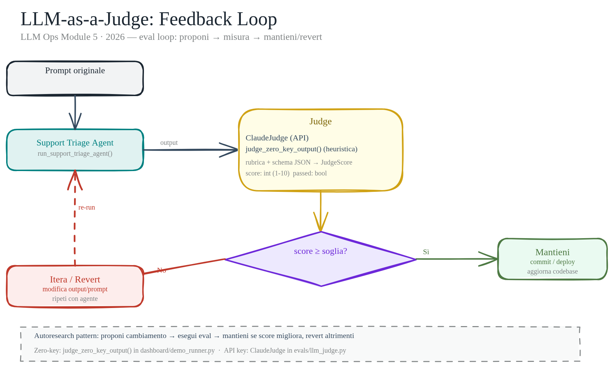
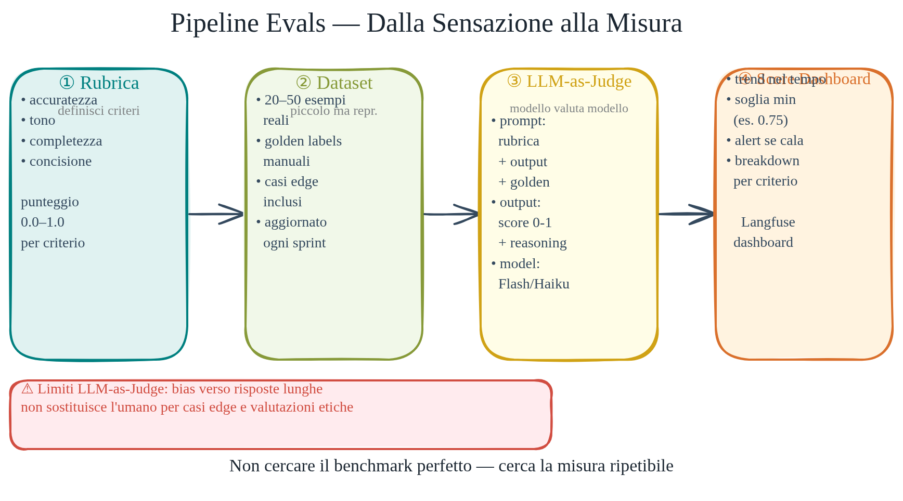

# Evals e LLM-as-a-Judge

> L'eval è il segnale che permette al loop di miglioramento di decidere.

Quando un agente risponde male, come lo sai? Puoi leggerlo tu, ma non puoi leggere diecimila chiamate. Puoi usare metriche aggregate, ma quelle ti dicono "qualcosa è peggiorato" senza dirti dove. L'eval strutturato è la risposta: un meccanismo automatizzato che assegna un punteggio a ogni output e ti permette di confrontare versioni, individuare regressioni e guidare le ottimizzazioni senza intervento umano continuo.

LLM-as-a-Judge estende questo concetto usando un modello linguistico come valutatore. Il giudice riceve il prompt originale, l'output prodotto, e una rubrica che definisce i criteri di qualità. Restituisce un punteggio numerico, un flag `passed`, e una motivazione in linguaggio naturale. Il vantaggio rispetto a una metrica classica è che riesce a valutare proprietà difficili da catturare con regex o regole: cortesia, completezza, aderenza al tono, assenza di informazioni inventate.

Il rischio è simmetrico al vantaggio: il giudice è un modello, ha i suoi bias, e non è infallibile. Usarlo bene significa capire quando è appropriato e quando invece una verifica deterministica è più affidabile e più economica.

## Perché gli eval non sono opzionali

Un agente senza eval è un agente che non puoi migliorare in modo controllato. Ogni modifica al prompt, ogni cambio di modello, ogni nuova versione del tool è un esperimento con esito ignoto. Puoi affidarti all'impressione soggettiva dopo qualche prova manuale, ma quella impressione non scala e non è riproducibile.

Il pattern verify loop richiede una metrica fissa su cui decidere se mantenere o revertire una modifica. Senza eval, il loop non ha segnale e diventa iterazione cieca. Un dataset iniziale annotato può ridurre il rischio di regressioni rispetto a prove manuali isolate.

Negli agenti di supporto, dove ogni risposta ha un impatto diretto sull'esperienza del cliente, l'eval non è un'aggiunta opzionale: è l'unico modo per sapere se stai andando nella direzione giusta.

## Il pattern verify loop

Il verify loop è semplice nella struttura: proponi una modifica → esegui l'agente su un dataset fisso → valuta con il judge → se il punteggio medio migliora, mantieni la modifica; altrimenti, revert.

```
modifica prompt/skill
        ↓
  esegui agent su dataset
        ↓
  judge valuta ogni output
        ↓
  score medio ≥ soglia?
     ↙        ↘
  mantieni    revert
```

La chiave è che il dataset e la soglia sono fissi prima di iniziare il loop. Non si aggiusta la soglia dopo aver visto i risultati — questo invaliderebbe l'intero meccanismo. Il judge diventa un segnale ripetibile da calibrare; il giudizio umano rimane necessario per controllare il judge stesso.

Nei contesti di autoresearch (agenti che migliorano se stessi), questo loop è la primitiva fondamentale: ogni ciclo gather→act→verify usa il punteggio eval come unica metrica di decisione.



## LLM-as-a-Judge — come funziona nel codice

La classe `ClaudeJudge` in `src/llm_ops_v1/evals/llm_judge.py` incapsula il pattern completo.

```python
class JudgeScore(BaseModel):
    score: int = Field(ge=1, le=10)
    passed: bool
    rationale: str
```

`JudgeScore` è un Pydantic `BaseModel` con tre campi: punteggio intero 1-10, flag booleano e motivazione testuale. Il metodo `judge_output` di `ClaudeJudge` serializza la rubrica, il prompt originale, l'output da valutare e lo schema JSON di `JudgeScore` in un unico payload, lo invia a Claude con il system prompt `"You are a strict evaluator. Return JSON only."`, e valida la risposta con `model_validate_json()`.

Lo schema JSON viene generato automaticamente da Pydantic con `JudgeScore.model_json_schema()` — questo significa che il modello riceve la struttura esatta del tipo atteso. La generazione resta probabilistica; la validazione dello schema è deterministica e fallisce in modo esplicito se il formato non è valido.



## Heuristica zero-key — l'eval senza API

Per scenari demo, sviluppo locale senza chiave API, o come filtro rapido prima di invocare il judge completo, `judge_zero_key_output` in `src/llm_ops_v1/dashboard/demo_runner.py` implementa una heuristica deterministica.

La logica è intenzionalmente semplice:

```python
word_count = len(output.split())
has_action = any(kw in output.lower() for kw in ["decision:", "reply", "escalate", "clarif"])
passed = word_count >= 15 and "TODO" not in output and has_action
score = 8 if passed else 4
```

Un output passa se ha almeno 15 parole, non contiene `TODO`, e include almeno una keyword che segnala un'azione esplicita. Restituisce lo stesso tipo `JudgeScore` del judge completo, quindi è intercambiabile nel pipeline.

Questo approccio è utile per sviluppo offline e per ridurre il costo quando si vuole un primo filtraggio rapido: si escludono le risposte chiaramente insufficienti con zero costo API, e si invoca `ClaudeJudge` solo sui casi borderline.

## Design di una rubrica efficace

Una rubrica generica produce punteggi generici. Una rubrica utile ha tre componenti precisi:

**Criteri espliciti.** Elenca esattamente cosa stai valutando: completezza della risposta, tono appropriato, presenza di un'azione concreta, assenza di informazioni non verificabili. Ogni criterio deve essere verificabile indipendentemente dagli altri.

**Bande di punteggio descritte.** Non basta dire "1-10". Il judge ha bisogno di ancoraggio: 1-4 significa risposta incompleta o scorretta; 5-7 accettabile ma migliorabile; 8-10 eccellente con motivazione specifica. Senza descrizioni delle bande, il punteggio 7 di un judge e il 7 di un altro non sono comparabili.

**Output JSON strutturato.** `ClaudeJudge` passa `JudgeScore.model_json_schema()` nel payload — Pydantic genera automaticamente lo schema corretto. Il judge sa esattamente la struttura attesa e non può restituire un formato diverso senza che la `model_validate_json()` fallisca con un errore esplicito.

Una rubrica per un agente di supporto clienti potrebbe essere: "Valuta se la risposta: (1) è cortese e non difensiva, (2) propone un'azione concreta e verificabile, (3) non inventa informazioni non presenti nel contesto. Usa la banda 8-10 solo se tutti e tre i criteri sono soddisfatti."

## Design del dataset di eval

Il dataset è il secondo elemento critico — una rubrica eccellente su un dataset mal costruito dà punteggi inutili.

Un dataset minimo efficace ha queste caratteristiche:

- **20-50 esempi** sono un dataset iniziale ragionevole per una demo o un primo smoke test
- **Distribuzione realistica**: includi i casi facili (risposta chiaramente corretta), i casi difficili (ambiguità, informazioni parziali), e i casi edge (richieste fuori scope, tono aggressivo del cliente)
- **Ground truth annotata**: almeno una parte degli esempi deve avere un punteggio umano di riferimento per calibrare la soglia di `passed`
- **Versionato con il codice**: il dataset è un artefatto del progetto, non un file locale sul laptop di qualcuno

Per questo progetto, gli scenari demo in `demo_runner.py` mostrano il pattern minimo: ticket diversi, output prodotto dal percorso zero-key, e punteggio di riferimento calcolato dal judge euristico. In produzione, questi diventano file JSON o record in database con tracciabilità completa.

## Limiti del judge — cosa sapere prima di fidarsi

**Self-eval bias.** Un modello che giudica output prodotti dallo stesso modello può confermare i propri bias. Il judge tende a valutare positivamente pattern stilistici simili ai propri output. Per ridurlo: usa modelli diversi, oppure calibra su esempi annotati da umani.

**Position bias.** Il judge può favorire output più lunghi o strutturati indipendentemente dalla qualità reale. Una rubrica che specifica esplicitamente "la concisione è un valore" mitiga il problema, ma non lo elimina completamente.

**Costo per volume.** Ogni chiamata al judge costa token. Per pipeline ad alto volume, la strategia corretta è: zero-key heuristic prima come filtro rapido, judge completo solo sui casi che superano la soglia minima o su campioni statistici.

**Calibrazione necessaria.** Un punteggio 7 non è oggettivo — dipende dalla rubrica, dal modello, e dalla distribuzione del dataset. Prima di usare il punteggio come segnale decisionale, servono esempi umani etichettati per stabilire dove si trova la soglia reale di `passed`.

**Quando usare test deterministici invece.** Se stai verificando fatti booleani — "l'output contiene un numero d'ordine?", "la classificazione è corretta?" — una regexp o un confronto esatto è più veloce, più economico e non ha bias. Il judge serve per proprietà qualitative che richiedono comprensione semantica.

## Come provare

Zero-key (nessuna API key necessaria):

```python
from llm_ops_v1.dashboard.demo_runner import judge_zero_key_output

score = judge_zero_key_output(
    prompt="Il mio ordine è in ritardo",
    output="Gentile cliente, ho verificato il tracking..."
)
print(score.model_dump())
```

Con API key (Claude judge):

```python
import asyncio
from llm_ops_v1.evals.llm_judge import ClaudeJudge

rubric = "Valuta se la risposta: (1) è cortese, (2) propone un'azione concreta, (3) non inventa informazioni."
score = asyncio.run(ClaudeJudge().judge_output(
    prompt="Il mio ordine è in ritardo",
    output="Gentile cliente, ho verificato il tracking...",
    rubric=rubric,
))
print(score.score, score.passed, score.rationale)
```

## Per approfondire

- [Building agents with Claude Agent SDK](resources/reading_list.md) — LLM-as-judge citato come segnale per il loop gather→act→verify
- [Anthropic — Evals and Productivity](resources/reading_list.md) — dati su produttività e misurazione
- [Diagramma editabile — judge feedback loop](../public/35-judge-feedback-loop.excalidraw) — loop proponi→eval→mantieni/revert (schema Excalidraw)

## RAGAS — eval agentico offline

RAGAS nasce come framework open-source per valutare pipeline RAG
(faithfulness, answer relevancy, context precision/recall). Dalla versione 0.2
include metriche agentiche che si applicano direttamente al triage agent:

- **Agent Goal Accuracy (WithReference)**: l'agente ha raggiunto l'obiettivo
  del ticket? Binaria (0/1). `WithReference` confronta l'esito contro il goal
  etichettato nel golden set; `WithoutReference` lo inferisce dalla conversazione
  (più rumorosa — evitarla in CI).
- **Tool Call Accuracy / F1**: ha chiamato i tool giusti, nell'ordine giusto,
  con gli argomenti giusti? Confronta la sequenza effettiva contro
  `reference_tool_calls`.
- **Topic Adherence**: l'agente è rimasto nel dominio previsto attraverso i turni?

### Come funziona

RAGAS valuta **trace complete** (`MultiTurnSample`), non solo l'output finale.
Ogni trace è una lista di messaggi `{role: human|ai|tool, content: str}`.
Il valutatore è un LLM-as-judge che legge la trace e assegna il punteggio.

Per pydantic-ai non esiste un converter pronto (RAGAS include integrazioni per
LangGraph, LlamaIndex, Bedrock e OpenAI Swarm). Il converter in
`evals/ragas_adapter.py` mantiene esplicita la trasformazione tra trace runtime
e sample di valutazione.

### Perché offline, non inline

RAGAS **non è uno strumento di monitoring di produzione**. Tre motivi concreti:

1. **LLM-as-judge** = ogni valutazione è una chiamata a un LLM. Inline su ogni
   request = latenza e costo raddoppiati, pagati su traffico che non blocca l'utente.
2. **Non deterministico** = lo stesso trace valutato due volte può dare punteggi
   diversi. Un singolo score di produzione è rumore, non segnale.
3. **Richiede reference** = `AgentGoalAccuracy` con reference funziona bene;
   la variante `WithoutReference` in produzione è troppo rumorosa.

### Architettura batch

```
Produzione:
  request → triage agent → trace opzionale / log strutturati
                                    ↓
  Batch job schedulato   → campiona 1-5% dei trace
  (fuori dal path utente) → converte in MultiTurnSample
                          → ragas.evaluate()
                          → metriche aggregate nel dashboard
```

Il monitoring live usa latency/cost/error rate da log strutturati ed eventuali trace;
RAGAS valuta la qualità su campione batch, mai inline.

### Evals umane strutturate

Il golden set (`evals/datasets/golden.jsonl`) è la baseline della regressione:

1. **Raccolta**: seleziona 15-50 ticket reali che coprono i casi limite
   (multi-issue, ambiguità alta, policy specifiche del dominio).
2. **Etichettatura**: per ogni ticket, un umano decide `expected_action`,
   `expected_category`, e scrive `notes` con i criteri di accettazione.
3. **Validazione**: un secondo revisore controlla almeno il 20% degli esempi.
4. **Manutenzione**: aggiungi esempi quando emerge un nuovo tipo di fallimento
   non coperto dal set esistente.

La regressione deterministica (`tests/evals/regression/test_golden_regression.py`)
gira in CI su ogni PR con `DeterministicJudge` (no API, <1s). La valutazione
con `ClaudeJudge` o RAGAS gira su schedule (nightly o pre-release).
