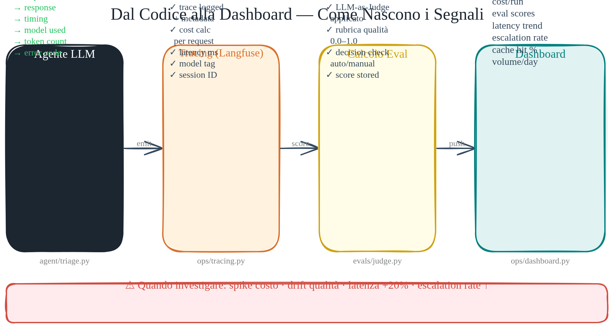
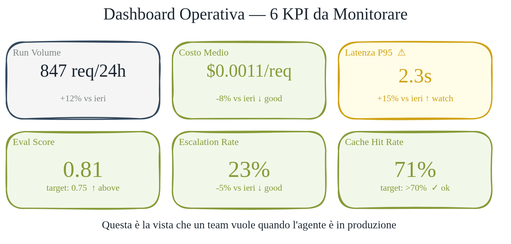

# Monitoring e Dashboard

> Un dashboard operativo deve rendere visibili pochi segnali affidabili.

Un agente in produzione genera dati a ogni run: quanto ha impiegato, quanto è costato, se ha scelto di rispondere, chiedere chiarimenti o escalare. Senza un punto di aggregazione, si perde visibilità operativa. Il dashboard serve a individuare variazioni di latenza, costo, qualità ed escalation prima che diventino incidenti.

In questo modulo costruiamo un dashboard operativo con Streamlit. La struttura è semplice: un dataclass per il record, uno store append-only in memoria, sette KPI calcolati al volo. Per la demo non servono database o infrastruttura aggiuntiva; fuori dalla demo lo store può diventare una query su Langfuse o su un OLAP.

Il flusso è lineare: l'agente esegue, produce un `DashboardRecord`, lo store lo accumula, `build_summary` aggrega i KPI, Streamlit visualizza. Ogni componente fa una cosa sola.

## Anatomia del dashboard — i 7 KPI

`DashboardSummary` è un frozen dataclass con sette campi. Ognuno risponde a una domanda operativa precisa.

| KPI               | Fonte                              | Domanda                            |
| ----------------- | ---------------------------------- | ---------------------------------- |
| `run_volume`      | `count(records)`                   | Quante run nella finestra osservata? |
| `avg_latency_ms`  | media di `latency_ms`              | L'infra regge? Il modello è lento? |
| `total_cost_usd`  | somma di `cost_usd`                | Il budget resta sotto controllo?   |
| `avg_cost_usd`    | `total_cost_usd / run_volume`      | Costo per task — è sostenibile?    |
| `avg_eval_score`  | media di `eval_score`              | La qualità tiene?                  |
| `escalation_rate` | `count(action="escalate") / total` | Il modello gestisce i ticket?      |
| `cache_hit_ratio` | `count(cache_hit=True) / total`    | Il caching funziona?               |

`build_summary(records)` prende la lista di `DashboardRecord` e restituisce il `DashboardSummary` calcolato. `build_table_rows` e `build_trend_rows` producono le strutture per le tabelle Streamlit. `build_action_counts` separa i record per azione — `reply`, `ask_clarification`, `escalate` — utile per il grafico a barre.



## Il modello dati — DashboardRecord

`DashboardRecord` in `dashboard/models.py` è un dataclass regolare (non frozen — può essere aggiornato). Campi principali: `run_id`, `prompt_preview`, `output_preview`, `latency_ms`, `cost_usd`, `eval_score`, `action`, `cache_hit` (default `False`), `timestamp` (default UTC now).

Il campo `action` accetta tre valori stringa: `"reply"`, `"ask_clarification"`, `"escalate"`. È la decisione dell'agente, non un enum — mantiene il modello semplice e leggibile.

`table_row()` produce un dict pronto per Streamlit: preview troncata a 60 caratteri, timestamp formattato, costo formattato in dollari. La logica di presentazione sta nel record, non nel template UI.

## Lo store pattern — semplicità by design

`DashboardStore` in `dashboard/store.py` nasce con una lista seed opzionale e può persistere su file JSON. Espone `append(record)` per accumulare, `replace(records)` per resettare lo storico demo, e `snapshot()` per leggere — restituisce una copia invertita, i record più recenti prima.

Nell'esecuzione locale il dashboard può salvare in `.runtime/dashboard-records.json`: non è produzione, ma evita il problema della demo che si resetta a ogni refresh. In produzione, `snapshot()` diventerebbe una query su Langfuse, Postgres, ClickHouse o un altro store osservabile.



## Demo data — scenari e live record

Il dashboard non parte più da fixture precaricate. Parte vuoto e offre una suite scenari: spedizione in ritardo, billing, reso incompleto, problema tecnico enterprise. Ogni scenario passa dal codice dell'agente, produce output, viene valutato, stimato economicamente e salvato come record.

`build_live_record(prompt, output, latency_ms)` crea un `DashboardRecord` a partire dall'output di una run reale. `estimate_demo_metrics(prompt, output)` applica un valore fittizio di cache hit ratio per stimare il risparmio — non è preciso, è didattico.

`run_live_triage()` in `app.py` esegue l'agente via `asyncio.run()` e registra il risultato nello store: il ciclo completo in una funzione.

## Segnali operativi — quando investigare

Quattro pattern da riconoscere immediatamente. In un sistema reale, soglie e azioni vanno adattate al dominio:

- **Spike di latenza**: problema infra o modello sotto carico. Prima azione: check provider status.
- **Cost drift in salita**: i prompt sono cresciuti? Il caching si è rotto? Controllare subito `cache_hit_ratio`.
- **Calo di `avg_eval_score`**: il prompt è degradato o lo scenario è cambiato? Confrontare con la baseline registrata.
- **Escalation surge**: il modello non riesce a gestire i ticket in arrivo. Allargare il training set o modificare le regole di routing.

Questi segnali sono elencati anche in `resources/survival_kit.md`, sezione "In esercizio", con le soglie p50/p95 suggerite.

## Backend di osservabilità — Langfuse e logging strutturato

`langfuse_setup.py` espone `get_langfuse_client()` e `flush_langfuse()`. Il client viene creato solo quando `LANGFUSE_PUBLIC_KEY` e `LANGFUSE_SECRET_KEY` sono configurate; in caso contrario gli helper restano no-op.

`structured_logging.py` fornisce `JsonFormatter` (timestamp UTC ISO, output JSON) e `get_logger(name)` con `StreamHandler`. I log strutturati sono leggibili dalle macchine — fondamentale quando i log finiscono in un aggregatore come Loki o CloudWatch.

## Come provare

Avviare il dashboard Streamlit completo:

```bash
uv run streamlit run src/llm_ops_v1/dashboard/app.py
```

Usare il dashboard programmaticamente, senza Streamlit:

```python
from llm_ops_v1.dashboard.demo_runner import build_live_record
from llm_ops_v1.dashboard.store import DashboardStore
from llm_ops_v1.dashboard.app import build_summary

store = DashboardStore([])
store.append(build_live_record("Il mio ordine e' in ritardo", "Decision: reply.", 350))
summary = build_summary(store.snapshot())
print(f"run_volume={summary.run_volume}, avg_cost=${summary.avg_cost_usd:.4f}")
```

## Per approfondire

- [survival_kit.md — sezione "In esercizio"](resources/survival_kit.md) — checklist operativa: soglie p50/p95, costo per task, cache hit monitoring
- [Langfuse](resources/reading_list.md) — tracing distribuito per agenti in produzione
- [Building Effective Agents — Anthropic](resources/reading_list.md) — transparency e observability come principi di design

## Drift detection

Il dashboard mostra KPI aggregati ma non rileva automaticamente quando la
distribuzione dei dati cambia. Il modulo `evals/drift.py` implementa PSI
(Population Stability Index) su tre dimensioni:

- **Lunghezza prompt** (PSI numerico): misura se i ticket in ingresso stanno
  diventando più lunghi/corti rispetto alla baseline.
- **Distribuzione azioni** (PSI categorico): misura se il mix reply/escalate/
  ask_clarification sta cambiando.
- **Score drift**: differenza assoluta tra media baseline e media corrente.

Soglie (configurabili in `monitoring/alerts.py`):
- PSI < 0.1 = stabile
- PSI 0.1–0.2 = monitorare
- PSI ≥ 0.2 = drift significativo → alert CRITICAL

`AlertEngine.evaluate(records, drift)` emette log strutturati WARN/CRITICAL
e opzionalmente chiama un webhook (`LLM_OPS_ALERT_WEBHOOK`).

## Pipeline metrica completa — evoluzione del dashboard

Il dashboard Streamlit persiste i record su file JSON (`.runtime/dashboard-records.json`).
È sufficiente per demo e sviluppo; non scala oltre ~10k record.

La pipeline metrica per produzione:

```
app → OpenTelemetry SDK (strumentazione)
    → OTLP exporter
    → Prometheus (scrape /metrics)
    → Grafana (dashboard + alerting)
    → Alertmanager → canale di reperibilità
```

Metriche da esporre (formato Prometheus):

| Metrica | Tipo | Label |
| --- | --- | --- |
| `llmops_request_total` | counter | model, backend, status |
| `llmops_latency_ms` | histogram | model, backend |
| `llmops_cost_usd_total` | counter | model |
| `llmops_cache_hits_total` | counter | — |
| `llmops_queue_depth` | gauge | — |
| `llmops_eval_score` | histogram | judge_type |

Per strumentare il codice esistente: aggiungi `opentelemetry-sdk` e
`opentelemetry-exporter-prometheus` come dipendenze opzionali, poi wrappa
`_run_backend` in un `with tracer.start_as_current_span(...)`.

Il repo include helper Langfuse (`observability/langfuse_setup.py`) per una
integrazione successiva. Prometheus resta il percorso principale per metriche
aggregate; Langfuse può essere collegato in seguito per trace per-request e
usage token.
