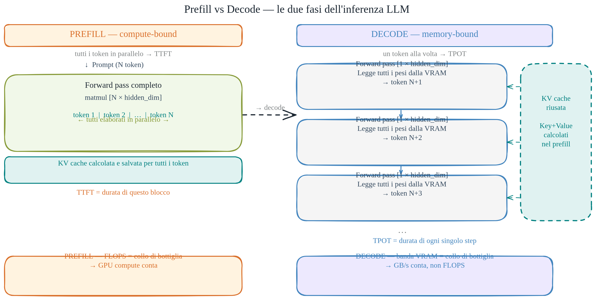

# Prefill, Decode e KV Cache

> Prefill e decode hanno profili di calcolo opposti. Capire questa asimmetria spiega praticamente tutte le scelte di ottimizzazione dell'inferenza.

Questo è il doc operativo centrale della serie theory. Tutto ciò che riguarda costo per token, latenza, prompt caching e performance dei modelli locali trova la sua spiegazione meccanica qui.



## Le due fasi dell'inferenza autoregressiva

Quando invii un prompt a un LLM, l'inferenza si divide in due fasi nettamente distinte.

### Prefill

Tutti i token del prompt vengono processati in un colpo solo, in parallelo. Il modello esegue un unico forward pass sull'intera sequenza di input. Durante questo passaggio:

1. Calcola gli embedding di tutti i token.
2. Per ogni layer di attention, calcola le matrici Key e Value per ogni token e le memorizza nella KV cache.
3. Produce il primo token di output.

Il prefill è **compute-bound**: stai eseguendo moltiplicazioni matrice × matrice su una sequenza di N token (la matrice ha dimensione `[N × hidden_dim]`), il che satura le unità di calcolo della GPU. I FLOPS sono il collo di bottiglia, non la banda di memoria. Un prompt da 2.000 token non costa 2.000 volte un prompt da 1 token in termini di latenza: il parallelismo assorbe il costo (fino a saturazione).

Il prefill determina il **TTFT** — Time To First Token. Se il TTFT è lento, il prompt è lungo o il modello è grande.

### Decode

Una volta generato il primo token, parte la fase autoregressiva: il modello genera un token alla volta. Per generare ogni token successivo:

1. Prende solo l'ultimo token generato.
2. Calcola la sua Query, e la sua K/V (che aggiunge alla cache).
3. Fa attention tra questa singola Query e tutte le K/V in cache.
4. Produce il token successivo.

Il decode è **memory-bound**: ogni step processa un solo token, quindi la moltiplicazione è matrice × vettore (`[1 × hidden_dim]`), che usa pochissimi FLOPS. Il costo vero è leggere i pesi del modello dalla VRAM ad ogni step. Con un modello da 7B in fp16 stai trascinando ~14 GB dalla memoria ad ogni singolo token generato. La GPU passa il tempo ad aspettare la memoria, non a calcolare.

Il decode determina il **TPOT** — Time Per Output Token. Se il TPOT è lento, il modello è grande o la banda di memoria della GPU è stretta.

TTFT e TPOT sono due leve indipendenti. Un prompt lungo rallenta il TTFT; non rallenta il TPOT. Aggiungere GPU aumenta i FLOPS; non aiuta il TPOT se la banda di memoria rimane uguale.

### Perché output costa di più dell'input

Ogni output token richiede un decode completo: un forward pass sui ~14 GB di pesi, limitato dalla banda di memoria. Ogni input token in prefill è elaborato in parallelo con gli altri: il costo per token si divide su tutta la sequenza. Strutturalmente, il decode è più costoso del prefill per token. I provider lo riflettono nel pricing: output token tipicamente 3–8× più costoso dell'input.

## KV Cache — la struttura che rende il decode possibile

Senza KV cache, ogni step di decode dovrebbe ricalcolare l'attention sull'intera storia — costo O(n²) ripetuto. Con la cache, il decode diventa lineare.

La KV cache memorizza le matrici Key e Value calcolate durante il prefill (e accumulate durante il decode). Non cambiano mai: dipendono solo dai token a cui appartengono, che sono già fissi. Ricalcolarle ad ogni step sarebbe lavoro sprecato.

### Dimensionamento in VRAM

La cache cresce linearmente con il numero di token. La formula:

```
byte_KV = 2 × n_layers × n_kv_heads × head_dim × seq_len × batch_size × byte_per_valore
```

Il 2 è perché tieni sia K che V. In un modello con Multi-Head Attention classica, `n_kv_heads × head_dim = hidden_dim`.

Esempio concreto — modello tipo Llama 2 7B, MHA, fp16 (2 byte/valore), batch = 1:

```
2 × 32 layer × 4096 × 2 byte = 524.288 byte ≈ 0,5 MB / token
```

Con context di 4.096 token: ~2 GB di KV cache. Con 32k token: ~16 GB — vicino o superiore ai pesi del modello stesso. Questo è il vero limite pratico ai context lunghi, non il calcolo.

## GQA — Grouped-Query Attention

La Grouped-Query Attention attacca direttamente il problema della KV cache. Invece di avere un set di K/V per ogni testa di Query, le K/V vengono condivise tra gruppi di teste. Llama 3 8B usa 8 KV-head invece di 32: la cache crolla di 4×.

Effetto pratico: da ~0,5 MB/token a ~128 KB/token sullo stesso modello. Con context da 128k token la differenza è dell'ordine dei 50 GB. I modelli recenti usano tutti GQA o varianti simili (es. MLA in DeepSeek) proprio per questo motivo — la capacità di reggere context lunghi senza esaurire la VRAM dipende quasi interamente dalla dimensione della KV cache.

La qualità cala pochissimo perché le Query mantengono la loro diversità: solo la "memoria" K/V è condivisa. È un trade quasi gratuito.

## Prompt caching — il caching salta il prefill

Quando il provider riceve un prompt il cui prefix statico è identico a una richiesta precedente, non deve rifare il prefill di quella parte: la KV cache è già calcolata e salvata. La risposta parte direttamente dal decode.

Il risparmio è 10× sul costo dei token cachati (Anthropic) perché si salta il calcolo più costoso. La KV cache del prefix statico — che può contenere migliaia di token di system prompt, policy, tool definitions — viene riusata gratis su ogni richiesta.

La meccanica completa del caching provider (hashing, invalidazione, dove vive la cache, Claude Code) è nel doc dedicato: [`04-prompt-caching-internals.md`](04-prompt-caching-internals.md).

## Per approfondire

- [`01-fondamenti.md`](01-fondamenti.md) — i fondamenti (tokenizzazione, embedding, attention)
- [`03-quantization-moe-hardware.md`](03-quantization-moe-hardware.md) — come quantizzazione e MoE cambiano il profilo hardware
- [`04-prompt-caching-internals.md`](04-prompt-caching-internals.md) — meccanica del caching provider
- [`../01-cost-and-routing.md`](../01-cost-and-routing.md) — il doc operativo sul costo e routing
