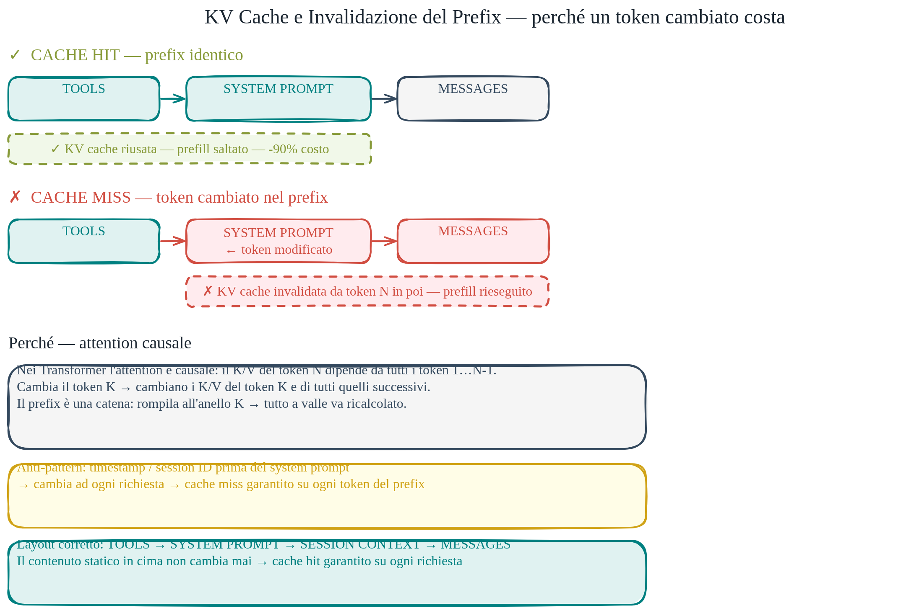

# Meccanica del Prompt Caching

> Il caching non è magia del provider: è il prefill che viene saltato. Questa pagina spiega il meccanismo e le sue implicazioni operative.

Il doc `02-context-memory-caching.md` insegna il **layout** che massimizza il cache hit rate. Questo doc spiega **perché** quel layout funziona, dove vive fisicamente la cache, e cosa la invalida.

## Come funziona il caching a livello di inferenza

Quando invii un prompt per la prima volta, il provider esegue il prefill: calcola le matrici Key-Value per ogni layer e per ogni token del prompt. Questo è il lavoro costoso.

Quando invii un secondo prompt che inizia con lo stesso identico prefix, il provider non deve rifare quel lavoro. La KV cache del prefix è già calcolata: viene caricata e si parte direttamente dal decode. Il prefill viene saltato interamente per la parte cachata.

Il risparmio dichiarato (~90% su Anthropic sui token cachati) riflette proprio questo: il costo di calcolo del prefill annullato.

## Dove vive la cache

La cache non è nel modello — è nell'infrastruttura di serving.

**In locale** (vLLM, Ollama, llama.cpp): la KV cache risiede nella VRAM della GPU. vLLM usa un sistema chiamato PagedAttention che frammenta la cache in blocchi virtuali per gestirla come la memoria paginata di un sistema operativo — evita la frammentazione e permette di ospitare più richieste in parallelo. Quando la VRAM si esaurisce, la cache più vecchia viene sfrattata. Non c'è nessun disco coinvolto nel loop di decode; la persistenza su disco riguarda eventualmente il salvataggio di sessioni, non l'inferenza attiva.

**Nei provider cloud** (Anthropic, OpenAI): la gestione è a livelli. I prefix usati più frequentemente risiedono in HBM vicino alle GPU per accesso immediato. Prefix meno recenti possono essere spostati su cluster Redis ad alta velocità o NVMe nel datacenter. Quando arriva una richiesta con cache miss su un nodo ma cache hit su un altro, la KV viene trasferita via rete interna. Il disco (NVMe) viene usato come livello di persistenza per prefix molto richiesti e per session caching di lunga durata — ma i dati vengono caricati in memoria prima del decode, non letti dal disco token per token.

## Hashing — come il provider riconosce il prefix

L'hash non viene calcolato sulla KV cache: viene calcolato sulla **sequenza di token ID** del prefix. Il processo è:

1. Il client invia il prompt. Il server lo tokenizza.
2. Viene calcolato un hash (tipicamente su blocchi di N token, es. 128 o 1024) della sequenza di interi risultante.
3. Il sistema cerca nella cache se esiste già un calcolo per quell'hash.
4. Cache hit → riusa la KV. Cache miss → esegue il prefill e salva la KV.

Conseguenza diretta: la sequenza di token deve essere **identica bit per bit**. Un carattere diverso produce token diversi; token diversi producono hash diverso; hash diverso = cache miss.

Non è sufficiente che il testo sia semanticamente uguale. "Salve" e "salve" (maiuscola vs minuscola) possono produrre token diversi; lo stesso vale per spaziatura, punteggiatura, encoding dei caratteri. Il provider non normalizza: confronta la sequenza esatta.

## Perché l'attention causale rende la catena fragile

L'attention nei Transformer è causale: il token N vede solo i token da 1 a N, mai quelli successivi. Il K/V di ogni token dipende da tutti i token che lo precedono.

Questo significa: se il token in posizione 50 cambia, i K/V di tutti i token dalla posizione 50 in poi devono essere ricalcolati — dipendono, direttamente o indirettamente, dal token 50. Non è possibile "patchare" solo il token modificato: la catena è rotta.

È il motivo per cui l'anti-pattern del timestamp prima del system prompt è così distruttivo: il timestamp cambia ad ogni richiesta, quindi la cache viene invalidata dal primo token, e nessun K/V del prefix successivo può essere riusato.

È anche il motivo per cui il layout TOOLS → SYSTEM PROMPT → SESSION CONTEXT → MESSAGES funziona: la parte statica (tools + system prompt) non cambia mai, la cache si costruisce una volta e viene riusata indefinitamente.

## Steering multi-turno — perché editare il passato obbliga al ricalcolo

In una conversazione multi-turno, ogni turno viene aggiunto alla sequenza. La KV cache si accumula man mano. Se decidi di "correggere" un messaggio passato — sia editorialmente che programmaticamente, come nei sistemi agentic che riscrivono la storia — la sequenza di token a partire da quel punto cambia. La KV cache dal punto di correzione in poi è invalidata e deve essere ricalcolata via prefill.

Non c'è modo di fare "append parziale" su una KV cache calcolata su una storia diversa. Il motivo è sempre l'attention causale: ogni K/V dipende dal contesto precedente. Cambia il contesto, cambia tutto ciò che ne dipende.

Pratica comune nei sistemi agentic: non modificare mai la storia, solo aggiungere. I sistemi di compaction che riassumono i turni precedenti (invece di mantenerli verbatim) invalidano la cache ma riducono il numero di token totali — il tradeoff va valutato caso per caso.

## Claude Code — cache breakpoint e invalidazione su edit

Claude Code (il CLI) usa i cache breakpoint dell'API Anthropic per mantenere efficiente il caching su context lunghi. Il sistema inserisce i breakpoint dopo blocchi stabili: le istruzioni di sistema, il contenuto di file letti in sessione, la struttura del progetto. Ogni breakpoint dice al provider "fino a qui il prefix è stabile, cachalo".

Quando modifichi un file durante una sessione e Claude Code lo rilegge, il blocco corrispondente nella sequenza cambia. La cache viene invalidata dal punto di quel blocco in poi. I blocchi precedenti restano cachati. Il prefill viene eseguito solo per la porzione modificata e per tutto ciò che la segue nella sequenza.

Questo è anche il motivo per cui la prima query di una sessione lunga (dove il contesto di progetto viene costruito da zero) è più lenta: nessuna cache disponibile. Le query successive, con lo stesso contesto, sono veloci: il prefill di tutto il codice sorgente non viene rieseguito.

## Normalizzazione del testo e cache hit rate

Una domanda pratica: ha senso normalizzare il testo dei prompt (correggere typo, collassare spazi multipli) per aumentare il cache hit rate?

Sì, ma con aspettative precise. La normalizzazione è utile per i **prompt di sistema e i documenti statici** che costruisci tu come sviluppatore: garantisce che variazioni involontarie (spazio finale, ritorno a capo diverso) non producano token diversi e non busteino la cache.

Per l'input degli utenti, la normalizzazione aiuta marginalmente: due utenti che fanno lo stesso errore di battitura verrebbero entrambi normalizzati verso il testo corretto, aumentando la probabilità di cache hit se quel prefix dinamico viene cachato. Ma l'input utente è la parte dinamica della sequenza — è la parte che varia per definizione. La cache hit rate si massimizza tenendo l'input utente breve e nella posizione finale, non normalizzandolo.

Importante: la normalizzazione del testo non è un meccanismo di difesa contro la prompt injection. Sono problemi ortogonali: uno gestisce la codifica del testo, l'altro gestisce i contenuti malevoli iniettati nel prompt. Non confondere i due.

## Per approfondire

- [`02-prefill-decode-kvcache.md`](02-prefill-decode-kvcache.md) — la meccanica del prefill e della KV cache
- [`../02-context-memory-caching.md`](../02-context-memory-caching.md) — il doc operativo: layout, anti-pattern, `savings_pct`
